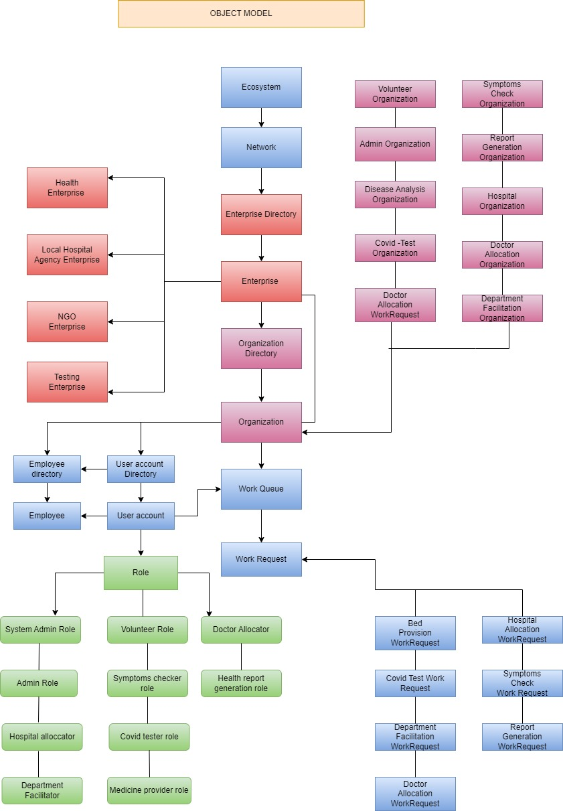
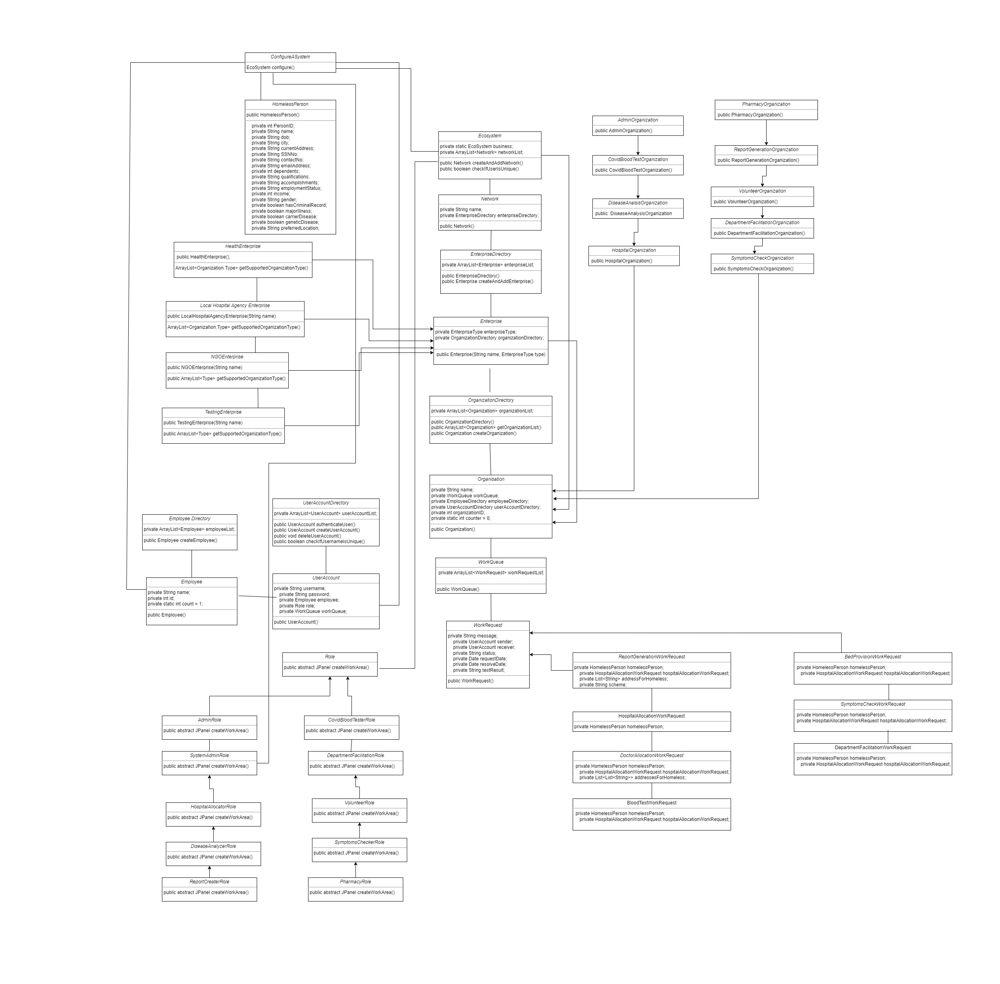
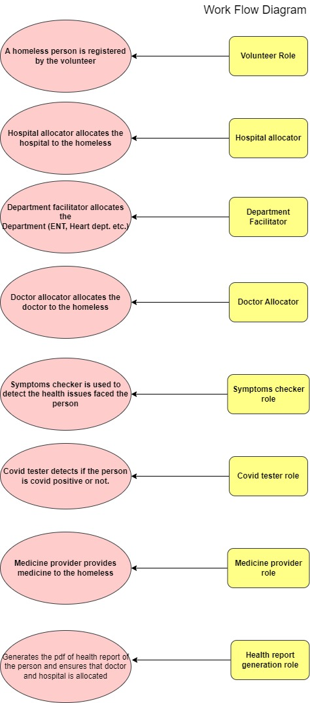

# AED-Project-Homeless-Helpers

## Problem Statement:
On a single night, more than half a million Americans go homeless, which represents 0.2% of the US population.
The connection between housing and homelessness is generally intuitive, but the strong link between health and homelessness is often overlooked.
Living on the street or in crowded homeless shelters is extremely stressful and made worse by being exposed to communicable disease 
(e.g. TB, respiratory illnesses, flu, hepatitis, etc.), violence, malnutrition,and harmful weather exposure.
We need a system which can help homeless people get proper health care facilities.

## Solution:
Homeless Helpers is an application that helps homeless people to get better healthcasre facilities by diminishing the gap between homeless people and hospitals.
Homeless people can get their treatment done in nearby hospital by only paying the amount they can afford.
This application is expected to reduce the health issues faced by homeless people and help in minimizing the health risks.

## Approach:

First,the homeless person registers with us and adds any medical history he has. After successful registration hospital is allocated to the person.
To detect the issue more precisely department is allocated. On the basis of department selected for a particular person symptoms are detected 
and covid test is done.
If the covid test is positive, person  is denied the entry to the hospital.
If the covid test is negative, proper disease analysis is done to find the medical issue faced by the person.
After successful diagnosis of disease and allocation of hospital Health report of the person is generated.

## System Participants
- NGO
- Hospital 
- Medicine Providers
- Docotrs
- Homeless Person
- Volunteer
- Assistant Docotr

All these participants are brought together under one digital ecosystem with role based login authentication for management and access of their involved workflows.

## Features

- Volunteers register for homless person
- Hosiptal is allocated tho the people based on their location preferences
- Department(ENT, Heart) is there to investigate the exact issue.
- Doctor is allocated by the assistant.
- Sending alerts via emails for registered persons.
- Raises request to detect the symptoms.
- Covid test is done if the symptoms are positive.
- Even if the covid test is negative, still the full diagnosis is done to make sure that person is not facing any other issue.
- Pdf is generated with all the details for future refrences.

## Tech Stack 💻 

- Java
- UI built using Java Swing
- Maven library used to simplify new dependency injection
- sendgrid API used for emails
- itextpdf library used for text to pdf generation.

## Team Members

- Amey Bansod
- Keerthana satheesh
- Rinki Kundu

